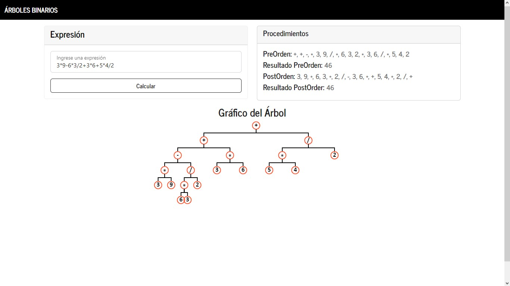

# Árboles Binarios

### *Instrucciones*
Crear un analizador de expresiones aritméticas considerando lo siguiente:
- Las expresiones pueden ser con las operaciones suma, resta, multiplicación y división, no se usarán paréntesis.
- Los números serán de **1 solo dígito.**
- El desarrollo debe incluir las siguientes 3 funcionalidades:
> 1. Tomar la expresión y generar el árbol binario, imprimiendo la notación preorder y postorder
> 2. Tomar una expresión preorder y generar el resultado
> 3. Tomar una expresión postorder y generar el resultado

**Entregar el repositorio en GIT**
